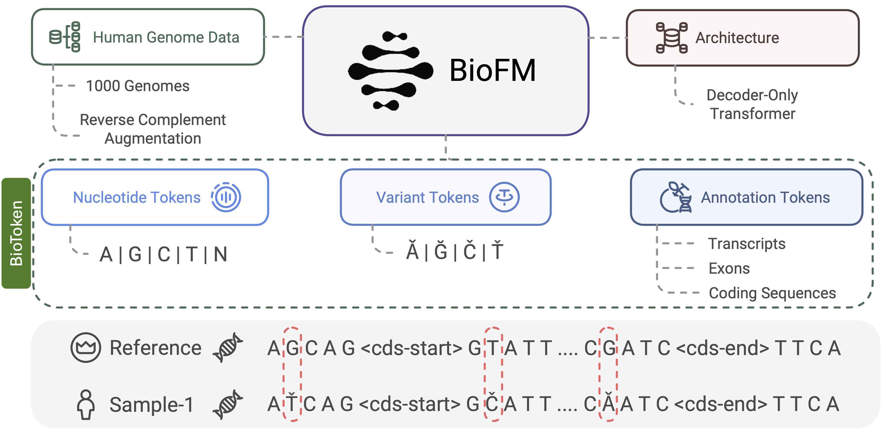

# BioFM-Eval: Biologically Informed Tokenization and Embedding Extraction

BioFM-Eval is a Python package for inference and embedding extraction from genomic sequences. It features biologically informed tokenization (BioToken) and annotation-based sequence processing for downstream analysis.



## Contents

- [Installation](#installation)
- [Features](#features)
- [Quick Start](#quick-start)
    - [Creating Variant Embeddings with BioFM](#creating-variant-embeddings-with-biofm)
    - [Sequence Embeddings with BioFM](#sequence-embeddings-with-biofm)
    - [Generation with BioFM](#generation-with-biofm)
- [License](#license)
- [Contribution](#contribution)
- [Citation](#citation)

## Installation

```bash
# Create a virtual environment
conda create -n biofm-eval-env python=3.11
conda activate biofm-eval-env

# Clone biofm-eval repository
git clone https://github.com/m42-health/biofm-eval.git
cd biofm-eval

# Install biofm-eval package
pip install -e .

```

## Features

- `Annotator`: Enables annotation of biological sequences with features such as variant information, genomic annotations, and functional elements.
- `AnnotatedTokenizer`: A biologically informed tokenizer (BioToken) that preserves annotations during tokenization for improved sequence representation.
- `AnnotatedModel`: Supports extracting embeddings from annotated tokens using models like BioFM, allowing downstream applications to effectively utilize biological context.

## Quick Start

### Creating Variant Embeddings with BioFM

This guide will help you quickly generate BioFM embeddings for the variants in your VCF file. These embeddings are created using the method described in our publication. The following steps provide a high-level overview of the embedding extraction process.

- For decoder-only models like BioFM, embeddings are extracted using upstream (before the variant) and downstream (after the variant) sequences to ensure consistency.
- A mutated upstream sequence and a mutated downstream sequence are constructed, both ending with the variant and having a length of half the evaluation context size.
- The downstream sequence is reverse complemented before extracting embeddings to align with the reference strand.
- The upstream and downstream reference sequences are averaged, and the upstream and downstream mutated sequences are averaged.
- The two averaged vectors (reference and mutated) are concatenated to form the final embedding.
- This approach ensures equal context availability for all models and accounts for the causal nature of decoder-only architectures.

```python
from biofm_eval import AnnotatedModel, AnnotationTokenizer, Embedder, VCFConverter
import torch

# Define paths to the pre-trained BioFM model and tokenizer
MODEL_PATH = "m42-health/BioFM-265M"
TOKENIZER_PATH = "m42-health/BioFM-265M"

# Load the pre-trained BioFM model and BioToken tokenizer
model = AnnotatedModel.from_pretrained(
    MODEL_PATH,
    torch_dtype=torch.bfloat16,
)
tokenizer = AnnotationTokenizer.from_pretrained(TOKENIZER_PATH)

# Initialize the embedder using the model and tokenizer
embedder = Embedder(model, tokenizer)

# Set up the VCF converter with paths to gene annotations and reference genome
vcf_converter = VCFConverter(
    gene_annotation_path="/data/pretrain/genomics/gencode.v38.annotation.gff3",
    reference_genome_path="/data/pretrain/genomics/hg38_reference/GCA_000001405.15_GRCh38_no_alt_plus_hs38d1_analysis_set.fna"
)

# Convert a VCF file into an annotated dataset using BioTokens
annotated_dataset = vcf_converter.vcf_to_annotated_dataset(
    vcf_path = '/data/pretrain/genomics/genome1000_corrected/HG01779_b.vcf.gz', 
    max_variants=200 # Set to None to process all variants in the VCF file
)

# Extract BioFM embeddings for all annotated variants
embeddings = embedder.get_dataset_embeddings(annotated_dataset)
print(embeddings)

# Example output (dict):
# {
#     'embeddings': array of shape (num_variants, 2*embedding_dim),  # Numeric embeddings for each variant
#     'labels': array of shape (num_variants,)  # Present only during supervised embedding extraction
# }

```

### Sequence Embeddings with BioFM
Embeddings for input DNA sequences can be generated for downstream tasks.

```python
from biofm_eval import AnnotatedModel, AnnotationTokenizer, Embedder, VCFConverter
import torch

# Define paths to the pre-trained BioFM model and tokenizer
MODEL_PATH = "m42-health/BioFM-265M"
TOKENIZER_PATH = "m42-health/BioFM-265M"

# Load the pre-trained BioFM model and BioToken tokenizer
model = AnnotatedModel.from_pretrained(
    MODEL_PATH,
    torch_dtype=torch.bfloat16,
)
tokenizer = AnnotationTokenizer.from_pretrained(TOKENIZER_PATH)

# Initialize the embedder using the model and tokenizer
embedder = Embedder(model, tokenizer)


# Generate sequence embedding
input_sequences = ['AGCT', 'GACTGCA']
sequence_embedding = embedder.get_sequence_embeddings(input_sequences)
print(f'Embedding dimension: {sequence_embedding.shape}')

# Embedding are extracted from the last token for each sequence
# Example output: torch.tensor of shape (num_sequences, embedding_dim) 

```


### Generation with BioFM
BioFM can generate genomic sequences based on input DNA prompts.

```python
from biofm_eval import AnnotatedModel, AnnotationTokenizer, Embedder, VCFConverter, Generator
import torch

# Define paths to the pre-trained BioFM model and tokenizer
MODEL_PATH = "m42-health/BioFM-265M"
TOKENIZER_PATH = "m42-health/BioFM-265M"

# Load the pre-trained BioFM model and BioToken tokenizer
model = AnnotatedModel.from_pretrained(
    MODEL_PATH,
    torch_dtype=torch.bfloat16,
)
tokenizer = AnnotationTokenizer.from_pretrained(TOKENIZER_PATH)

# Initializing the generator using model and tokenizer
seq_generator = Generator(model, tokenizer)

# Generate DNA sequences
input_sequences = ['AGCT', 'GACTGCA']
output = seq_generator.generate(
    input_sequences, 
    max_new_tokens=10, 
    temperature=1.0, 
    do_sample=True, 
    top_k=4)

print(output)

# Example output: List[str] = ['AGCTACTCCCCTCC', 'GACTGCACCACTGTACT']

```

## License

This project is licensed under the (TODO) License - see the LICENSE file for details.

## Contribution

Contributions are welcome! Please feel free to submit a Pull Request. 

## Citation
If you find this repository useful, please consider giving a star and citation:
```
title={BioToken and BioFM – Biologically-Informed Tokenization Enables Accurate and Efficient Genomic Foundation Models}
author={}
```

